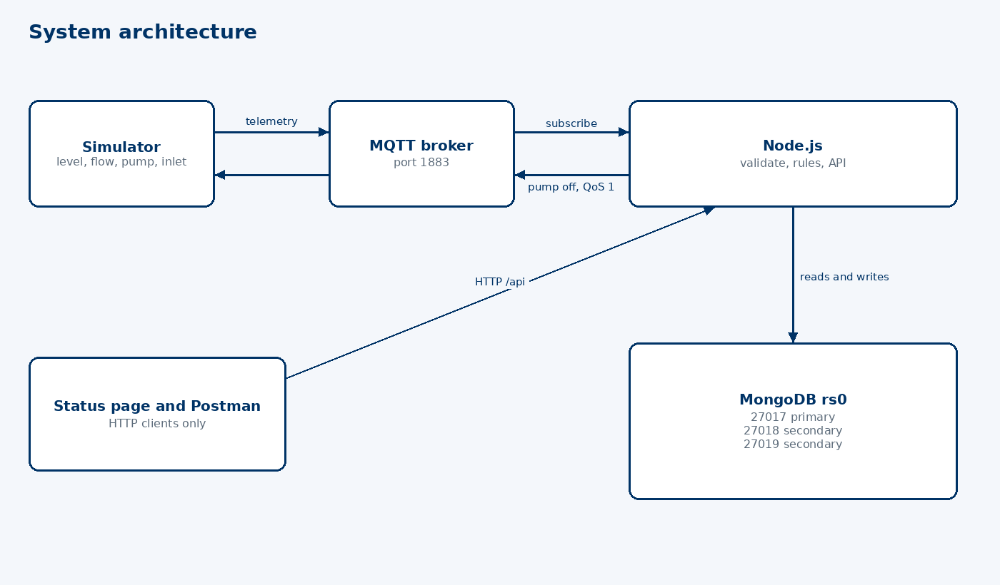
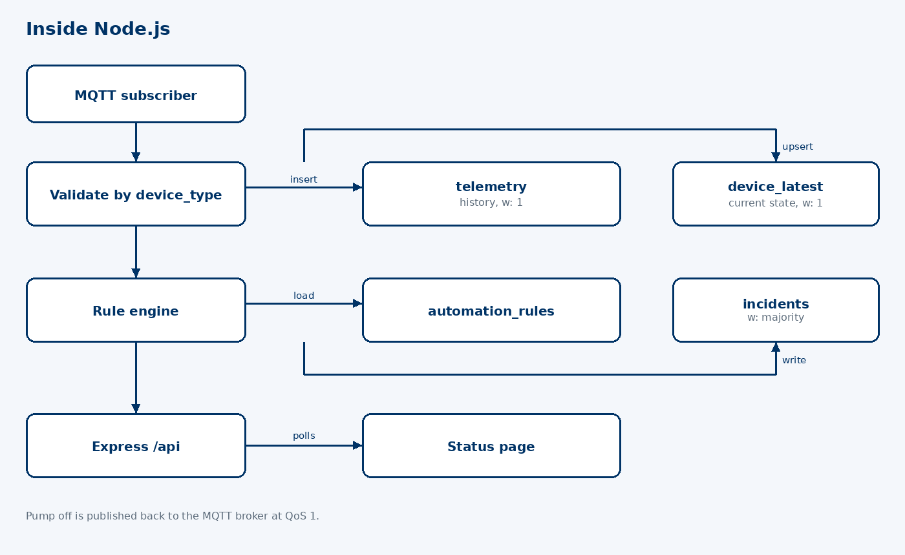
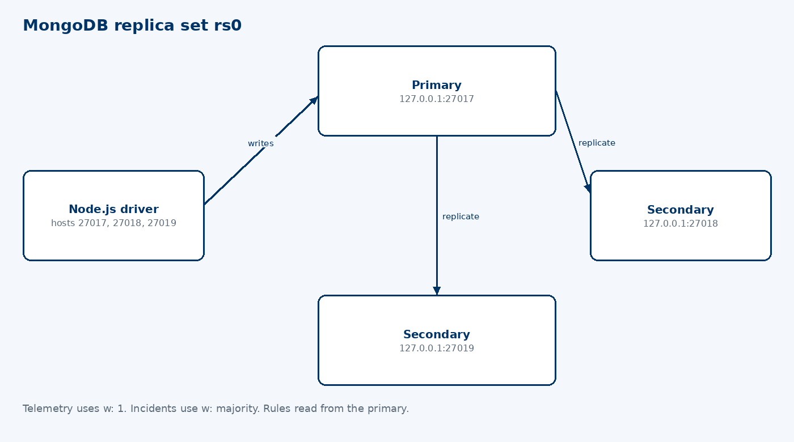
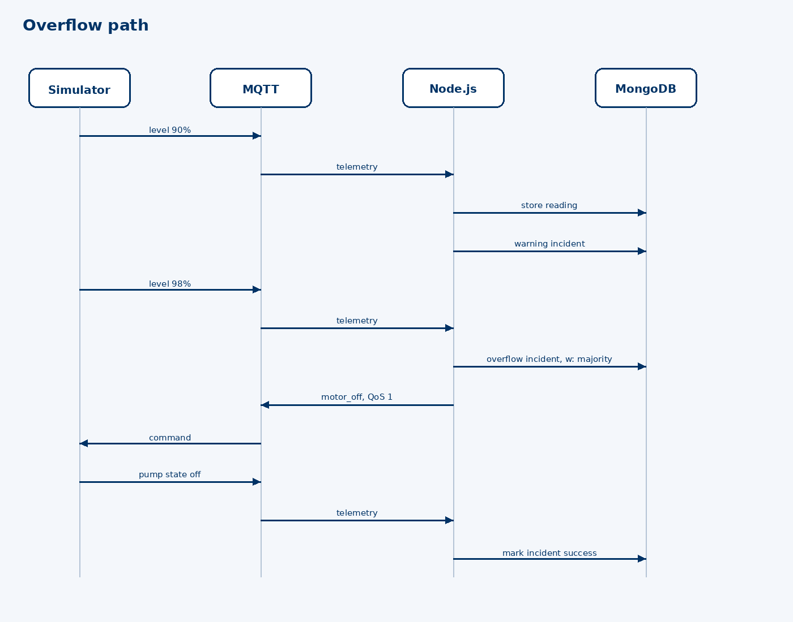

# Smart household water tank — plan and what is built

The user turns the pump on and walks away. The system watches the tank and switches the pump off before it overflows.

This is the CMP6207 project for ioThings: a simulated household tank, MQTT, a Node.js rule engine, a REST API, and MongoDB replica set `rs0`. The marked submission is still this system plus the 4,000-word report. This file is the working record of the decisions and the code that followed them.

## Decisions that stayed locked

- Warning at **90%** while the pump is on: write an incident, do not send a command.
- Pump off at **98%** while the pump is on. The demo does not wait for 100%, because 100% is already an overflow.
- Each sensor publishes its own MQTT message. `telemetry.reading` has a different shape per `device_type`. The status page joins the current values from `device_latest`.
- Four devices: `tank_level`, `water_flow`, `motor_state`, `source_presence`. The inlet sensor is what separates a dry pump from a broken pump.
- Rules are a condition list (`device_type`, `field`, `operator`, `value`), not a raw MongoDB query.
- A warning is an incident on the API and the status page. There is no Telegram bot and no phone push.
- Database name `smart_water`. Replica set `rs0` on ports 27017, 27018, and 27019.
- Telemetry and `device_latest` use write concern `w: 1`. Incidents use `w: "majority"`. The rule engine reads from the primary.
- Litres saved on an overflow cutoff is `flow_rate_lpm × 20`.

Left out on purpose: humidity, temperature, a combined level-plus-flow message, an 85% watch tier, a cutoff at 100%, pet climate, the idle-charger plug, a mobile app, and real hardware.

## Architecture

The simulator publishes one reading per sensor. Node.js validates it, stores it, updates `device_latest`, then runs the rules. A pump-off command goes back through MQTT. The status page and Postman talk only to the API.

Topics:

- `ioThings/{home_id}/{tank_id}/{device_type}/{device_id}/telemetry`
- `ioThings/{home_id}/{tank_id}/motor/{device_id}/command` at QoS 1

Collections: `tanks`, `devices`, `telemetry`, `device_latest`, `automation_rules`, `incidents`.

Seeded ids: `home_001`, `tank_roof_01`, capacity 1000 litres, pump `motor_roof_01`.

## Rules

| Severity | Condition | Action |
| --- | --- | --- |
| `warning` | level ≥ 90 and pump on | incident only |
| `overflow_prevented` | level ≥ 98 and pump on | `motor_off` and incident |
| `dry_run` | pump on and `water_present` false | `motor_off` and incident |
| `pump_failure` | pump on, water present, flow about 0, level not rising | incident only |
| `abnormal_flow` | pump off and flow > 0 | incident only |
| `confirmed_fault` | off command sent and pump still on after 30 seconds | mark the open incident escalated |

A multi-sensor rule runs only when the readings it needs were updated together. A flow value from before the pump changed state does not count.

## API

Base `http://localhost:3000/api`.

- `GET /health`
- Tanks: `GET /tanks`, `POST /tanks`, `GET /tanks/:tankId`, `PUT /tanks/:tankId`, `DELETE /tanks/:tankId`
- Devices: `GET /devices`, `POST /devices`, `GET /devices/:deviceId`, `PUT /devices/:deviceId`, `DELETE /devices/:deviceId`
- Rules: `GET /rules`, `POST /rules`, `PUT /rules/:ruleId`, `DELETE /rules/:ruleId`
- Telemetry: `POST /telemetry`, `GET /telemetry?deviceId=&from=&to=`
- Incidents: `GET /incidents`, `GET /incidents/stats`, `GET /incidents/:incidentId`, `PATCH /incidents/:incidentId`
- `POST /motors/:deviceId/override` with `{ "command": "on" }` or `{ "command": "off" }`

`GET /incidents/stats` returns counts by severity, average detection-to-cutoff time, litres saved, and average level by day.

## What is built

| Piece | Where | State |
| --- | --- | --- |
| Replica set `rs0` | ports 27017–27019, data under `mongodb/` | Running. You started and initialised it. |
| Seed, models, indexes | `backend/src/seed.js`, `backend/src/models/` | Done. `npm run seed` |
| MQTT ingest and rule engine | `backend/src/ingest.js`, `backend/src/rules/` | Done |
| REST API | `backend/src/routes/` | Done |
| Status page | `backend/src/public/index.html` | Done. Polls the tank and recent incidents. |
| Simulator | `simulator/src/simulator.js` | Done. `normal`, `overflow`, `dry-run`, `pump-failure`, `abnormal-flow`, `fault` |
| Embedded MQTT broker | `backend/src/broker.js` | Done. Listens on 1883 when that port is free. Mosquitto is used instead if it is already there. |

Checked against the live replica set:

- Health returned MongoDB connected, MQTT connected, replica set `rs0`.
- Overflow: warning at 92%, pump off at 98%, incident `overflow_prevented` with status `success` and 300 litres saved.
- Dry-run, pump failure, and abnormal flow each opened an incident. Dry-run closed with status `success` after the pump switched off.
- `POST /api/devices` and `DELETE /api/devices/:deviceId` succeeded.
- The status page returned HTTP 200.

## Still to capture for the report

- Run `npm run simulate fault` and keep the incident that becomes `confirmed_fault` after 30 seconds.
- Stop the primary during an overflow, record election time from `rs.status()`, and show the cutoff incident still stored. Restart that node so it rejoins as a secondary.
- Save screenshots in `evidence/` for replica status, one document per collection, CRUD, the stats JSON, and failover.
- Write the 4,000-word report: NoSQL appraisal, relational comparison, cluster setup, and this implementation.
